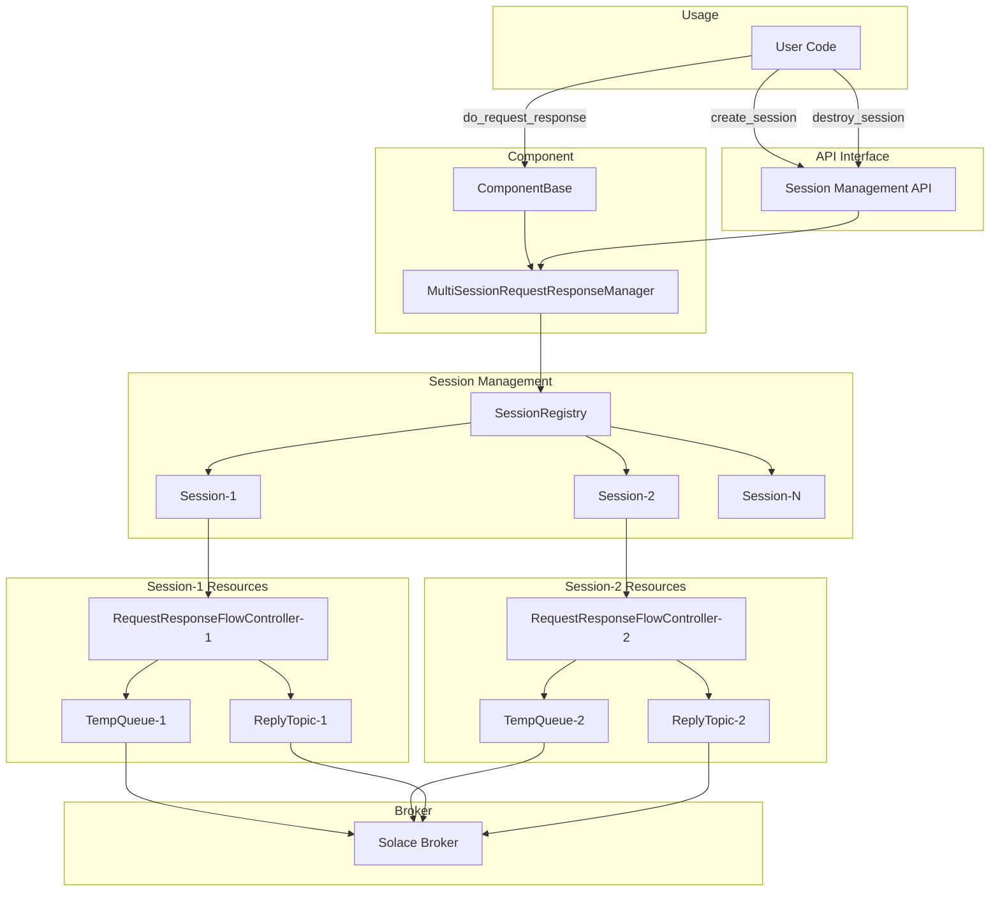

# Multi-Session Request/Reply Architecture Plan

## Overview
This plan outlines the implementation of multiple dynamic broker request/reply sessions for solace-ai-connector components. Each session will operate independently with its own configuration, temp queues, and async operation capabilities.

## Current Architecture Analysis

### Existing Components:
- **BrokerRequestResponse**: Single session request/reply component using temp queues
- **RequestResponseFlowController**: Manages single request/reply flow with internal broker component
- **ComponentBase**: Provides `do_broker_request_response()` method for single session

### Key Findings:
1. Current architecture uses one `RequestResponseFlowController` per component
2. Each controller creates one temp queue with unique UUID-based naming
3. Response correlation uses metadata in user properties
4. Sessions are tied to component lifecycle (created at startup, destroyed at shutdown)

## Proposed Architecture

### Core Components:



### New Classes:

1. **MultiSessionRequestResponseManager**
   - Manages multiple independent sessions
   - Provides API for session lifecycle management
   - Handles session registry and cleanup

2. **RequestResponseSession**
   - Encapsulates individual session state and configuration
   - Wraps RequestResponseFlowController with session-specific config
   - Manages session-specific temp queues and topics

3. **SessionRegistry**
   - Thread-safe registry for tracking active sessions
   - Provides session lookup by ID
   - Handles session timeout and cleanup

## API Design

### Session Management API:
```python
# Create a new session with custom configuration
session_id = component.create_request_response_session(
    broker_config={
        "broker_url": "tcp://localhost:55555",
        "broker_username": "user", 
        "broker_password": "pass",
        "broker_vpn": "vpn"
    },
    request_expiry_ms=60000,
    response_topic_prefix="custom/reply",
    response_queue_prefix="custom-queue"
)

# Use the session for request/response
response = component.do_broker_request_response(
    message, 
    session_id=session_id
)

# List detailed status of active sessions
sessions = component.list_request_response_sessions()
# Example return:
# [
#   {
#     "session_id": "...", "created_at": ..., "last_used_at": ..., 
#     "active_request_count": 0, "is_expired": False
#   }
# ]

# Destroy a session
component.destroy_request_response_session(session_id)
```

### Enhanced ComponentBase Methods:
```python
def do_broker_request_response(self, message, session_id=None, stream=False, streaming_complete_expression=None):
    """
    Performs broker request-response using specified session or default session.
    
    Args:
        message: The request message
        session_id: Optional session ID. If None, uses default session behavior
        stream: Whether response is streaming
        streaming_complete_expression: Expression to detect end of stream
    
    Returns:
        Response message or generator for streaming responses
    """
```

## Key Design Principles

1. **Session Isolation**: Each session operates independently with its own resources
2. **API-Driven Lifecycle**: Sessions created/destroyed via explicit API calls
3. **Backward Compatibility**: Existing single-session functionality unchanged
4. **Resource Management**: Automatic cleanup of broker resources
5. **Concurrent Operations**: Multiple sessions handle requests simultaneously
6. **Configuration Flexibility**: Each session can have different broker configs, timeouts, topic patterns

## Implementation Strategy

### Phase 1: Core Infrastructure
- Create MultiSessionRequestResponseManager class
- Create RequestResponseSession class  
- Create SessionRegistry for thread-safe session tracking
- Implement basic session lifecycle (create/destroy)

### Phase 2: Integration
- Extend ComponentBase with multi-session support
- Add session-aware do_broker_request_response method
- Implement backward compatibility layer
- Add session timeout and cleanup mechanisms

### Phase 3: Testing & Documentation
- Create comprehensive unit tests
- Create integration tests with real broker connections
- Add example configurations and usage documentation
- Performance test concurrent session operations

## Benefits

1. **Scalability**: Components can handle multiple concurrent request/reply patterns
2. **Flexibility**: Each session can target different brokers or use different configurations
3. **Isolation**: Session failures don't affect other sessions
4. **Resource Efficiency**: Temp queues created/destroyed on demand
5. **Backward Compatibility**: Existing code continues to work unchanged

## Considerations

1. **Resource Management**: Need careful cleanup of broker connections and temp queues. The design includes a configurable `max_sessions` limit to prevent resource exhaustion and an idle timeout for automatic cleanup.
2. **Thread Safety**: Session registry and all session management operations must be thread-safe.
3. **Error Handling**: Session-specific error handling is required. If a session is destroyed or expires, any in-flight requests waiting on a response must immediately raise an exception to the caller.
4. **Monitoring**: Session health and metrics are critical. The `list_sessions` API will provide detailed status (age, active requests, etc.) for observability.
5. **Configuration Validation**: Session configurations must be validated before creation to prevent runtime errors.
